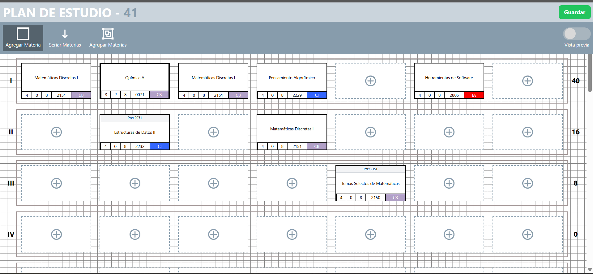
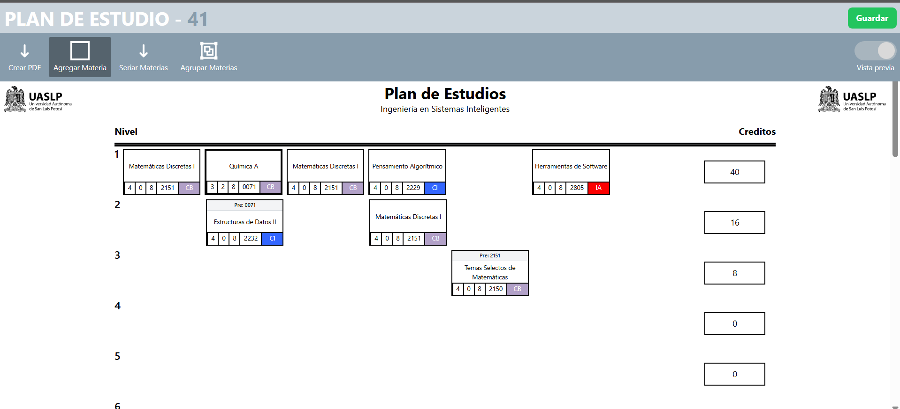

# Study Plan Designer

Study Plan Designer is an interactive web application for designing and visualizing academic study plans in a flexible and intuitive way.

## Overview

This tool enables academic institutions or curriculum designers to create study plans by arranging subjects on a visual canvas. Users can define subject prerequisites (serialization), group subjects by sections with color coding, and export the result to a PDF format. The application is built with usability and clarity in mind.

## Features

- Canvas-based layout for subject organization
- Subject serialization by displaying prerequisite subject codes
- Subject grouping with background color and borders to represent sections
- Rich text editor for descriptive notes and curriculum details
- Persistent state saving and loading
- PDF export including both the canvas and textual content

## Screenshots

### Subject Canvas Editor

This is the main interactive editor where users place and organize subjects visually.



### PDF Export Preview

This shows how the study plan looks when exported to PDF.



## Technologies Used

- HTML, CSS, JavaScript
- Vue.js or React (depending on implementation)
- Canvas or SVG rendering for layout
- LocalStorage or backend integration for saving state
- PDFMake or jsPDF for generating PDFs

## Getting Started

### Prerequisites

- Node.js and npm installed on your system

### Installation

```bash
git clone https://github.com/your-username/study-plan-designer.git
cd study-plan-designer
npm install
npm run dev
